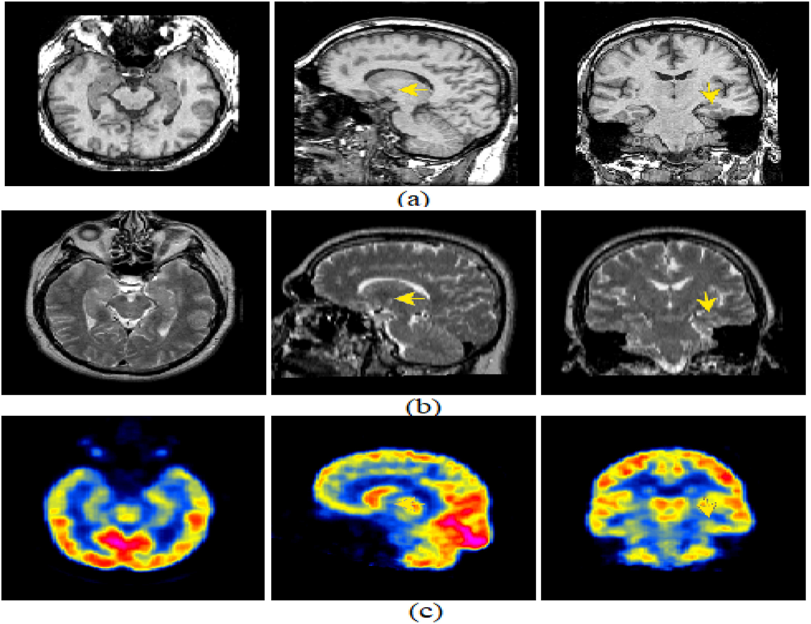
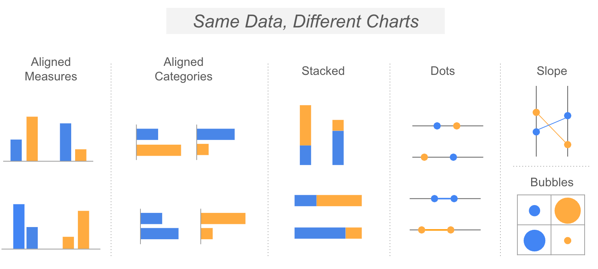
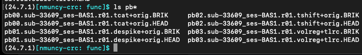
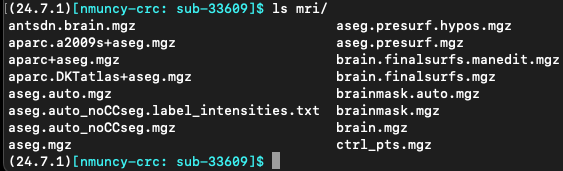
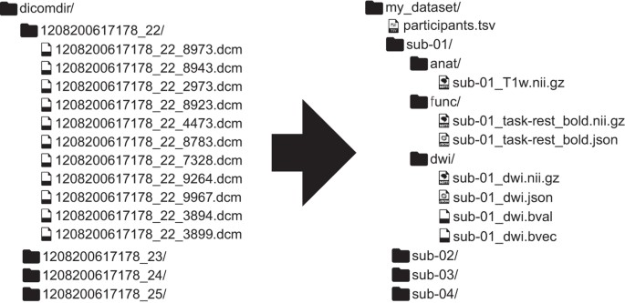
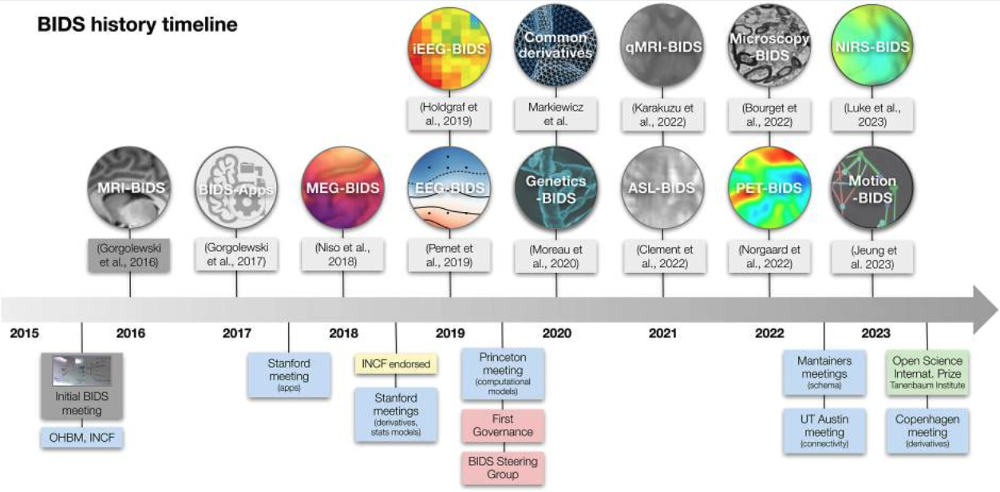

## MRI: Big Data

::::: columns
:::: {.column width="50%" style="font-size: 65%;"}
MRI research data is complex:

- File types (anatomic, diffusion, functional)
- File stages (original, intermediate, final)
- Many for each subject, session

Researchers need to manage:

- Multiple projects (from same data set)
- Multiple data sets (collected across time, labs)

Modern studies involve 200+ participants!

- Millions of files
- Terabytes of data
- E.g. [Human Connectome Project](https://www.humanconnectome.org/study/hcp-young-adult)

::::

:::: {.column width="\"50%"}
::: {.r-stack}

:::
::::
:::::

## Researcher Organization

::::: columns
:::: {.column width="50%" style="font-size: 65%;"}
Critical question: how do we keep it straight?

Notes:

1. Every researcher organizes their data __reasonably__
2. Every researcher organizes their data __differently__

This makes things impossible:

- Labs differ in their organization
- Researchers differ within a lab
- Projects differ within a researcher

::::

:::: {.column width="\"50%"}
::: {.r-stack}

:::
::::
:::::

## Software Organization

::::: columns
:::: {.column width="50%" style="font-size: 65%;"}
Software suites organize data differently (recall pre-NIfTI file types):

- AFNI
- FSL
- FreeSurfer
- Others ...

Implications:

- Need to learn multiple file structures
- Pipeline construction unwieldy
- Fun: guess how someone trained based on data

::::

:::: {.column width="\"50%"}
::: {ayout-ncol=1}

:::
::::
:::::

## BIDS: The Specification

::::: columns
:::: {.column width="50%" style="font-size: 65%;"}
- 2016: [The Brain Imaging Data Structure](articles/gorgolewski_2016_bids.pdf)
- Purpose:
  1. Minimize data curation
  2. Reduce errors
  3. Optimize data usage
  4. Facilitate automated tools
- Detailed:
  1. [The Specification](https://bids-specification.readthedocs.io/en/stable/)
  2. [BIDS Homepage](https://bids.neuroimaging.io/getting_started/index.html)

::::

:::: {.column width="\"50%"}

::::
:::::

## BIDS: High Level

::::: columns
:::: {.column width="50%" style="font-size: 65%;"}
- System of naming and organizing files
- Adopts key-value pairs in names
- Supports multiple data modalities
- Preempts stranded files
::::

:::: {.column width="\"50%"}

::::
:::::

## BIDS: File structure

Rawdata (original)
Subject
Session
File type
Side car (NIfTI limitations)
dataset_description
participants.tsv

## BIDS: File name

Common fields
Specific fields

## BIDS: File types

Anat
DWI, bvec, bval
Func, task TSV

## Validator

## Software

fMRIPrep

## Outside rawdata

Derivatives
sourcedata

## Best practices

rawdata
derivatives - pipeline - subject
analyses - final files
prune

## Sources

MRI: Big Data

- Azam, M. A., Khan, K. B., Salahuddin, S., Rehman, E., Khan, S. A., Khan, M. A., ... & Gandomi, A. H. (2022). A review on multimodal medical image fusion: Compendious analysis of medical modalities, multimodal databases, fusion techniques and quality metrics. Computers in biology and medicine, 144, 105253.

Organizing Data

- https://filwd.substack.com/p/a-takeaway-message-model-for-data

BIDS: The Specification

- Gorgolewski, K. J., Auer, T., Calhoun, V. D., Craddock, R. C., Das, S., Duff, E. P., ... & Poldrack, R. A. (2016). The brain imaging data structure, a format for organizing and describing outputs of neuroimaging experiments. Scientific data, 3(1), 1-9.

- [Tutorial](https://verbundprojekte.pages.uni-marburg.de/tam/datahub/UserManual/Workflow_tutorials/rdm/bids/)

BIDS: High Level

- Poldrack, R. A., Markiewicz, C. J., Appelhoff, S., Ashar, Y. K., Auer, T., Baillet, S., ... & Gorgolewski, K. J. (2024). The past, present, and future of the brain imaging data structure (BIDS). Imaging Neuroscience, 2, imag-2.