## Medical Image

::::: columns
:::: {.column width="50%" style="font-size: 65%;"}
Three ways to conceptualize:

1. Representation of internal structure/function
2. Mapping of numeric values to spatial position
3. Data line converted to matrix projected to screen

Important to maintain data integrity:

1. Surgery
2. Diagnoses
3. Investigation
::::

:::: {.column width="\"50%"}
::: {.r-stack}
{.fragment .fade-in-then-out}

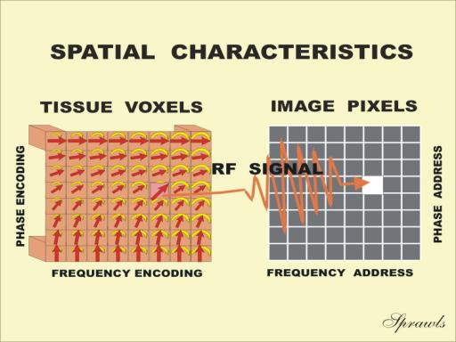{.fragment .fade-in-then-out}

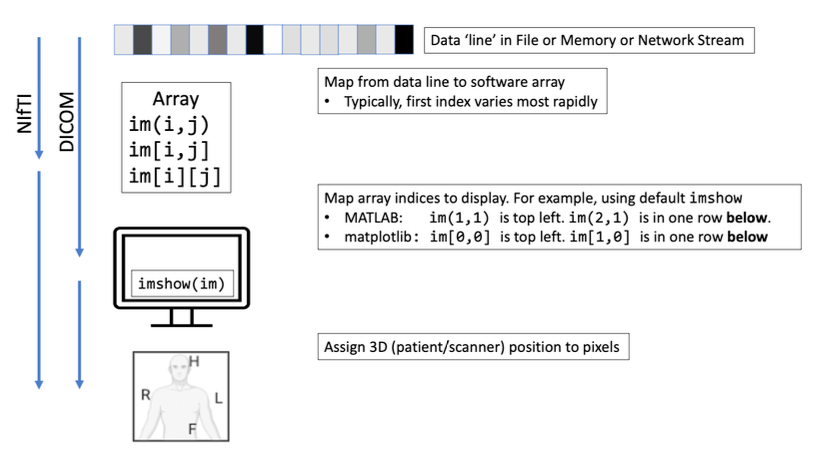{.fragment .fade-in-then-out}
:::
::::
:::::

## Medical Image: Three P's

::::: columns
:::: {.column width="50%" style="font-size: 65%;"}
- Pixel Depth
  - Number of bits per pixel
- Photometric Interpretation
  - Samples per pixel (number of channels)
- Pixel data
  - Stored as integer, float; Scaling factor
  - Comes after header (metadata)
  - Size = rows x columns x pixel depth (x time)
::::

:::: {.column width="\"50%"}
::: {.r-stack}
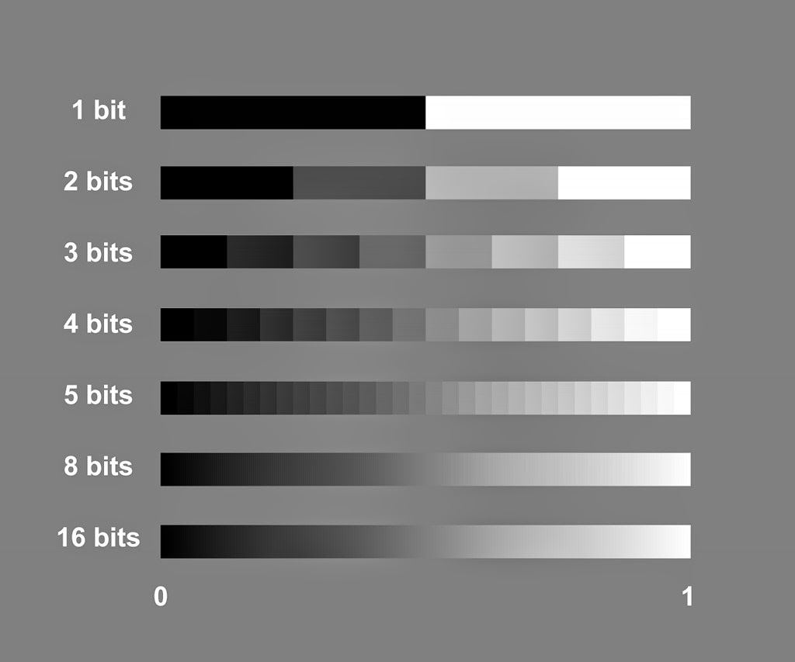{.fragment .fade-in-then-out}

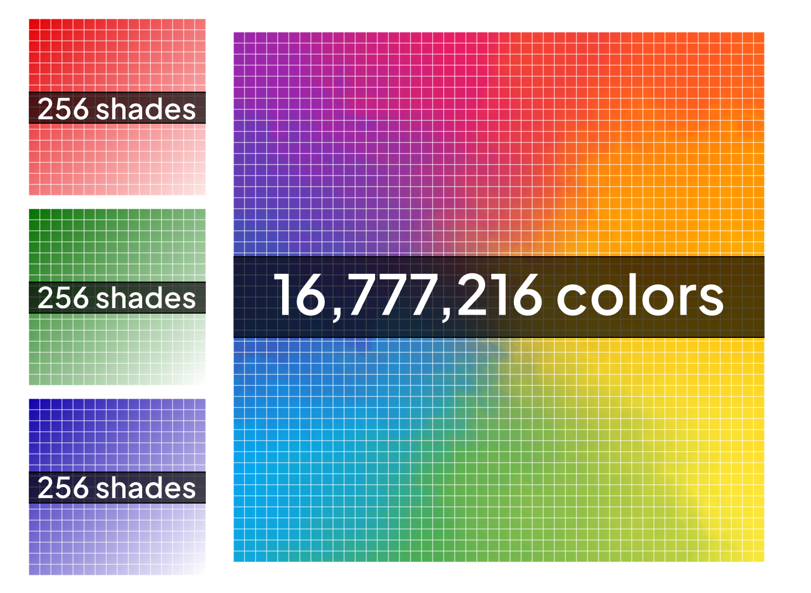{.fragment .fade-in-then-out}

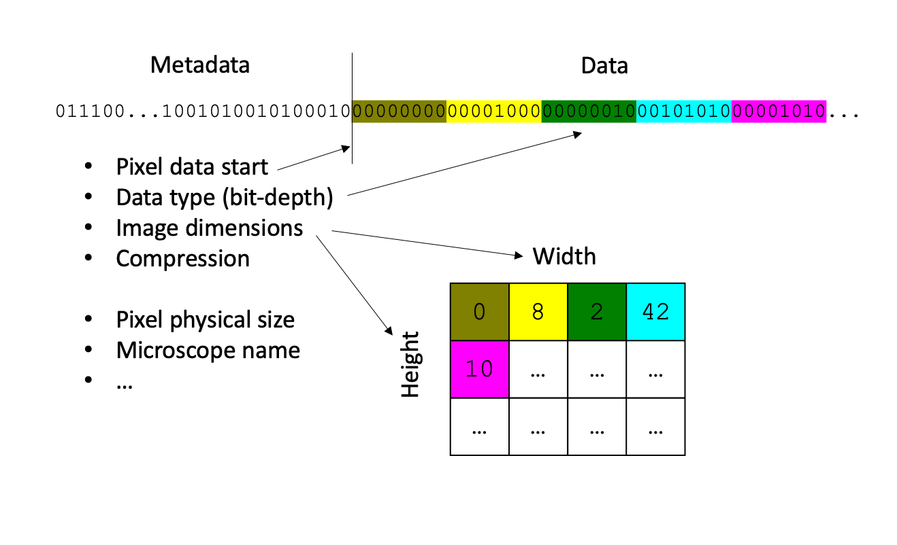{.fragment .fade-in-then-out}
:::
::::

:::{.notes}
Pixel depth: 8 bits = 1 byte
  - 256 x 256 pixels at 16 bits
  - 2 bytes per pixel
  - 256 x 256 x 2 = 131,072 bytes for image
Photo Interp:
  - Monochrome: one sample per pixel (black/white)
  - Pseudo-color: multiple samples, limited color palette
  - True color:  24 bits (e.g. RGB)
:::
:::::

## Medical Image: Metadata

::::: columns
:::: {.column width="50%" style="font-size: 65%;"}
- Beginning of data line
- Contains information to interpret data line
  - Image matrix dimensions
  - Spatial resolution
  - Pixel depth
  - Photometric Interpretation
- Additional
  - Scan protocol
  - Type of Scanner
  - Patient Info
::::

:::: {.column width="\"50%"}
::: {.r-stack}

:::
::::
:::::

## Clinical Data: DICOM

::::: columns
:::: {.column width="50%" style="font-size: 65%;"}
- [Digital Imaging and Communications in Medicine](articles/bidgood_1997_dicom.pdf)
- Details:
  - Acquisition
  - Request
  - Transfer
  - File Structrure
  - More ...
- Complex
  - [22 Parts](https://www.dicomstandard.org/current)
  - 4000+ pages

::::

:::: {.column width="\"50%"}
::: {.r-stack}

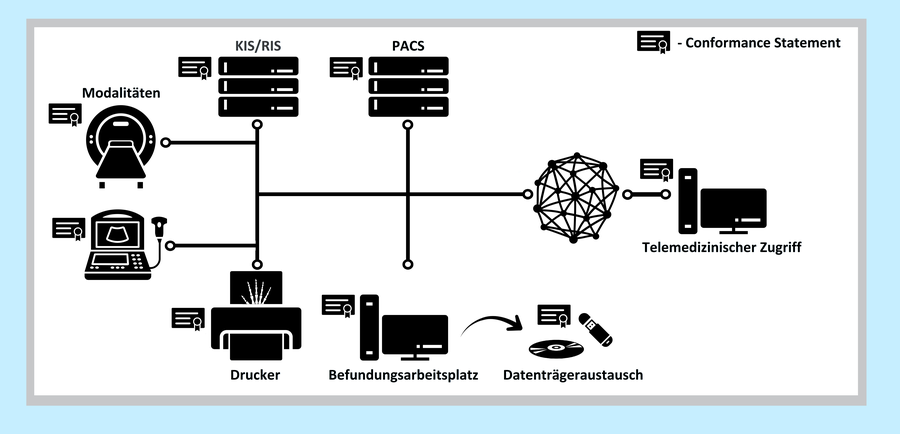

:::
::::
:::::

## DICOM: Structure
::::: columns
:::: {.column width="50%" style="font-size: 65%;"}
- Single file format: [Header & Data](https://www.dicomstandard.org/concepts)
- Comprehensive
- [Header](https://www.leadtools.com/help/sdk/v20/dicom/api/overview-basic-dicom-file-structure.html)
  - Scanner
  - Patient
  - Protocol
  - Notes

::::

:::: {.column width="\"50%"}
::: {.r-stack}

<!-- 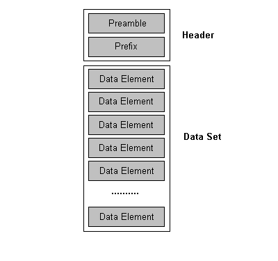{.fragment .fade-in-then-out} -->

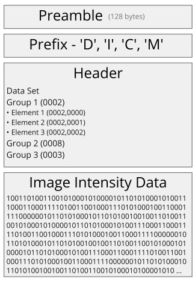

:::
::::
:::::

## DICOM: Data Element

::::: columns
:::: {.column width="50%" style="font-size: 65%;"}
- Header organized into Data Elements (called attributes)
- Four main parts:
  - [Tag](https://www.dicomlibrary.com/dicom/dicom-tags/)
  - VR: Coded datatype
  - Length: Number of bytes in Value
  - Value: Information

::::

:::: {.column width="\"50%"}
::: {.r-stack}

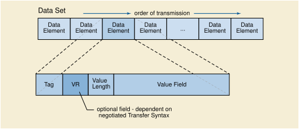{.fragment .fade-in-then-out}

{.fragment .fade-in-then-out}

:::
::::
:::::

:::{.notes}
Tags
- (XXXX, XXXX)
- Even = Standard
- Odd = Private
:::

## DICOM: Header

::::: columns
:::: {.column width="50%" style="font-size: 65%;"}
- Common Groups
  - 0002: Meta information
  - 0008: Session information
  - 0010: Patient information
  - 0018: Protocol information

- Others ...
- Notice: Tag, Length, Meaning, Information
::::

:::: {.column width="\"50%"}
::: {.r-stack}

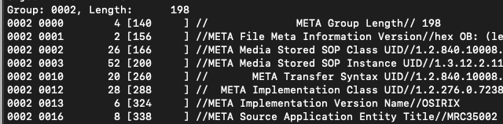{.fragment .fade-in-then-out}

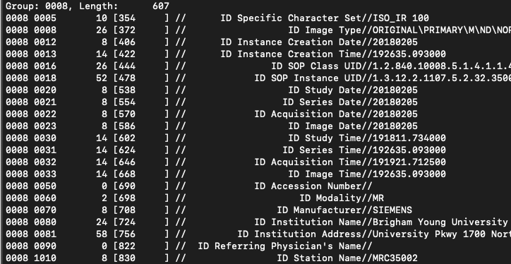{.fragment .fade-in-then-out}

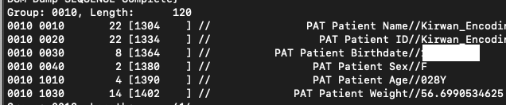{.fragment .fade-in-then-out}

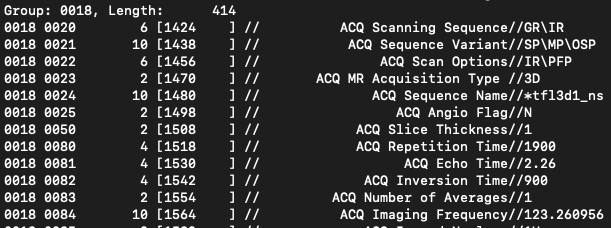{.fragment .fade-in-then-out}

:::
::::
:::::

## DICOM: Mining

## Research Data: Multiple Formats
- SPM (Analyze; img and hdr)
- FreeSurfer (MGH, MGZ) (https://surfer.nmr.mgh.harvard.edu/fswiki/FsTutorial/MghFormat)
- AFNI (BRIK, HEAD)
- HDF5 (https://www.hdfgroup.org/solutions/hdf5/medicine/)
- Tower of Babel Problem

<!-- Find examples (maybe in documentation) of each time -->

## NIfTI
Neuroimaging Informatics Technology Initiative (NIfTI)
Simple
https://nifti.nimh.nih.gov/
https://brainder.org/2012/09/23/the-nifti-file-format/

## NIfTI: Structure
Header, Data (Analyze; img hdr)
Combined (nii)
Formal structure (easy for multiple packages)

## NIfTI: Resolve issues
Ambiguous left
Embed orientation
Dimensionality
fMRI (4), DWI (6), Statistics (4-7)

## NIfTI: Orientation
DICOM - LPS
NIFTI - RAS
MNI - LPI
AFNI - RAI

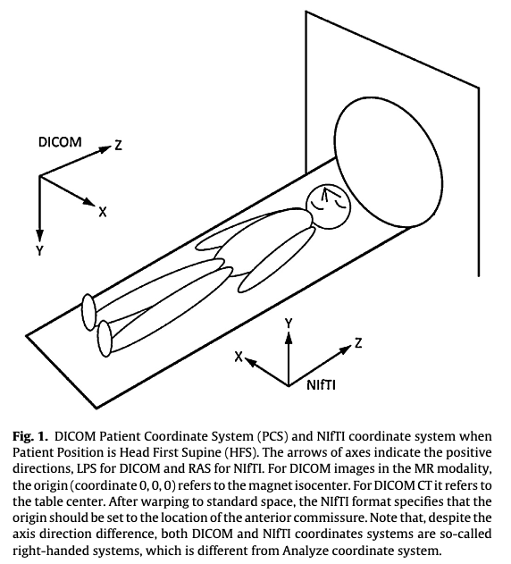

## NIfTI: Conversion

## NIfTI: Mining

## Sources
Medical Image
- [Radiopaedia](https://radiopaedia.org/articles/mri-sequences-overview?lang=us)
- [Sprawls](https://www.sprawls.org/mripmt/MRI09/index.html)
- Atkinson, D. (2022). Geometry in medical imaging: DICOM and NIfTI formats.

Medical Image: Three P's

- [Pixel Depth](https://www.the-working-man.org/2014/12/bit-depth-color-precision-in-raster.html)
- [Photometric](https://www.renewedvision.com/blog/color-depth-and-channels-explained)
- [Pixel Data](https://neubias.github.io/training-resources/image_file_formats/index.html)

Medical Image: Metadata

- [Pixel Data](https://neubias.github.io/training-resources/image_file_formats/index.html)

Clinical Data: DICOM

- [DICOM](https://dicom.offis.de/en/general/dicom-introduction/)

DICOM: Structure

- [Header](https://www.leadtools.com/help/sdk/v20/dicom/api/overview-basic-dicom-file-structure.html)
- [Structure](https://www.oak-tree.tech/blog/dicom-primer)

DICOM: Data Element

- [Data Element](https://dicom.nema.org/medical/dicom/current/output/chtml/part05/chapter_7.html)

<!-- Outline: Review larobina 2014
Data string, medical image
Pixel depth
Photometric interpretation
Metadata
Pixel data

Clinical
DICOM
File + network communication protocol
Header + Data, no separation
Comprehensive
Header - protocol, patient info, variable
Tags
  Format
  Order
Phoenix
LPS, 0 = iso

Research
Analyze
Header, Data
Simple
Formal structure
NIfTI
Resolve issues (ambiguous left)
Embed orietnation
Multidim - fMRI (4), DWI (6), statistics (4-7)
RAS, 0 = AC

View DICOM
Mine DICOM header
dcm2niix
View NIfTI
Mine NIfti header
-->

<!-- Practice - Install AFNI, FSL. Mine DICOM header
Practice - Install Mango, view DICOM stack
Practice - Mine info from fruit
-->