## Medical Image

::::: columns
:::: {.column width="50%" style="font-size: 65%;"}
Three ways to conceptualize:

1. Representation of internal structure/function
2. Mapping of numeric values to spatial position
3. Data line converted to matrix projected to screen

Important to maintain data integrity:

1. Surgery
2. Diagnoses
3. Investigation
::::

:::: {.column width="\"50%"}
::: {.r-stack}
{.fragment .fade-in-then-out}

{.fragment .fade-in-then-out}

{.fragment .fade-in-then-out}
:::
::::
:::::

## Medical Image: Three P's

::::: columns
:::: {.column width="50%" style="font-size: 65%;"}
- Pixel Depth
  - Number of bits per pixel
- Photometric Interpretation
  - Samples per pixel (number of channels)
- Pixel data
  - Stored as integer, float; Scaling factor
  - Comes after header (metadata)
  - Size = rows x columns x pixel depth (x time)
::::

:::: {.column width="\"50%"}
::: {.r-stack}
{.fragment .fade-in-then-out}

{.fragment .fade-in-then-out}

{.fragment .fade-in-then-out}
:::
::::

:::{.notes}
Pixel depth: 8 bits = 1 byte
  - 256 x 256 pixels at 16 bits
  - 2 bytes per pixel
  - 256 x 256 x 2 = 131,072 bytes for image
Photo Interp:
  - Monochrome: one sample per pixel (black/white)
  - Pseudo-color: multiple samples, limited color palette
  - True color:  24 bits (e.g. RGB)
:::
:::::

## Medical Image: Metadata

::::: columns
:::: {.column width="50%" style="font-size: 65%;"}
- Beginning of data line
- Contains information to interpret data line
  - Image matrix dimensions
  - Spatial resolution
  - Pixel depth
  - Photometric Interpretation
- Additional
  - Scan protocol
  - Type of Scanner
  - Patient Info
::::

:::: {.column width="\"50%"}
::: {.r-stack}


:::
::::
:::::

## Clinical Data: DICOM

::::: columns
:::: {.column width="50%" style="font-size: 65%;"}
- [Digital Imaging and Communications in Medicine](articles/bidgood_1997_dicom.pdf)
- Details:
  - Acquisition
  - Request
  - Transfer
  - File Structrure
  - More ...
- Complex
  - [22 Parts](https://www.dicomstandard.org/current)
  - 4000+ pages

::::

:::: {.column width="\"50%"}
::: {.r-stack}


:::
::::
:::::


## DICOM: Structure
::::: columns
:::: {.column width="50%" style="font-size: 65%;"}
- Single file format: [Header & Data](https://www.dicomstandard.org/concepts)
- Comprehensive
- [Header](https://www.leadtools.com/help/sdk/v20/dicom/api/overview-basic-dicom-file-structure.html)
  - Scanner
  - Patient
  - Protocol
  - Notes

::::

:::: {.column width="\"50%"}
::: {.r-stack}


:::
::::
:::::

## DICOM: Data Element

::::: columns
:::: {.column width="50%" style="font-size: 65%;"}
- Header organized into Data Elements (called attributes)
- Four main parts:
  - [Tag](https://www.dicomlibrary.com/dicom/dicom-tags/)
  - VR: Coded datatype
  - Length: Number of bytes in Value
  - Value: Information

::::

:::: {.column width="\"50%"}
::: {.r-stack}

{.fragment .fade-in-then-out}

{.fragment .fade-in-then-out}

:::
::::
:::::

:::{.notes}
Tags
- (XXXX, XXXX)
- Even = Standard
- Odd = Private
:::

## DICOM: Header

::::: columns
:::: {.column width="50%" style="font-size: 65%;"}
- Common Groups
  - 0002: Meta information
  - 0008: Session information
  - 0010: Patient information
  - 0018: Protocol information

- Others ...
- Notice: Tag, Length, Meaning, Information
::::

:::: {.column width="\"50%"}
::: {.r-stack}

{.fragment .fade-in-then-out}

{.fragment .fade-in-then-out}

{.fragment .fade-in-then-out}

{.fragment .fade-in-then-out}

:::
::::
:::::

## DICOM: Mining Header

::::: columns
:::: {.column width="50%" style="font-size: 65%;"}
- Reporting protocols (manuscripts)
- Parameters during workflows (DWI)
- Identifying data
- Useful tools:
  - AFNI's [dicom_hdr](https://afni.nimh.nih.gov/pub/dist/doc/program_help/dicom_hdr.html) (shell)
  - Pydicom's [dcmread](https://pydicom.github.io/pydicom/stable/reference/generated/pydicom.filereader.dcmread.html#pydicom.filereader.dcmread) (python)

::::

:::: {.column width="\"50%"}
::: {.r-stack}

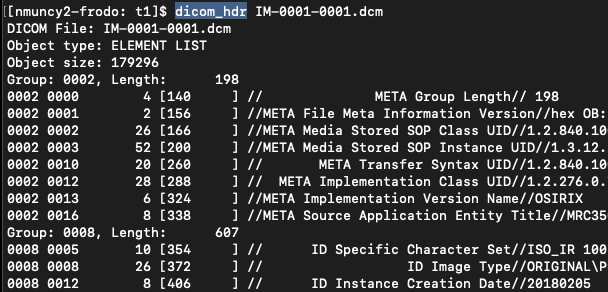{.fragment .fade-in-then-out}

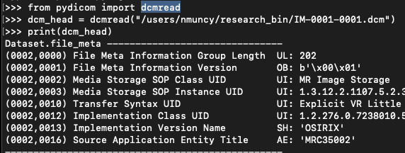{.fragment .fade-in-then-out}

:::
::::
:::::

## Research Data: Tower of Babel

::::: columns
:::: {.column width="50%" style="font-size: 65%;"}
- Many formats, each with different use cases
- Common:
  - [Analyze](articles/analyze_7.5.pdf): Image & Header
  - FreeSurfer: [MGH, MGZ]((https://surfer.nmr.mgh.harvard.edu/fswiki/FsTutorial/MghFormat))
  - AFNI: [BRIK & HEAD](https://afni.nimh.nih.gov/pub/dist/doc/htmldoc/nifti/notes.html)
- Others:
  - [HDF5](https://www.hdfgroup.org/solutions/hdf5/medicine/)
  - [MINC](https://www.mcgill.ca/bic/software/minc)
  - [CIFTI](https://www.nitrc.org/projects/cifti/)

::::

:::: {.column width="\"50%"}
::: {.r-stack}

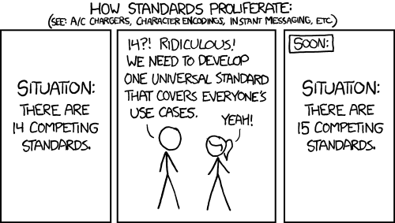

:::
::::
:::::

## NIfTI

::::: columns
:::: {.column width="50%" style="font-size: 65%;"}
- [Neuroimaging Informatics Technology Initiative (NIfTI)](https://nifti.nimh.nih.gov/)
- Developed by [Data Format Working Group](https://nifti.nimh.nih.gov/dfwg/index.html)
  - Supported by AFNI, FSL, SPM
- Simple, standard, streamline
- [Poster](articles/hbm_nifti_2004.pdf)
::::

:::: {.column width="\"50%"}
::: {.r-stack}

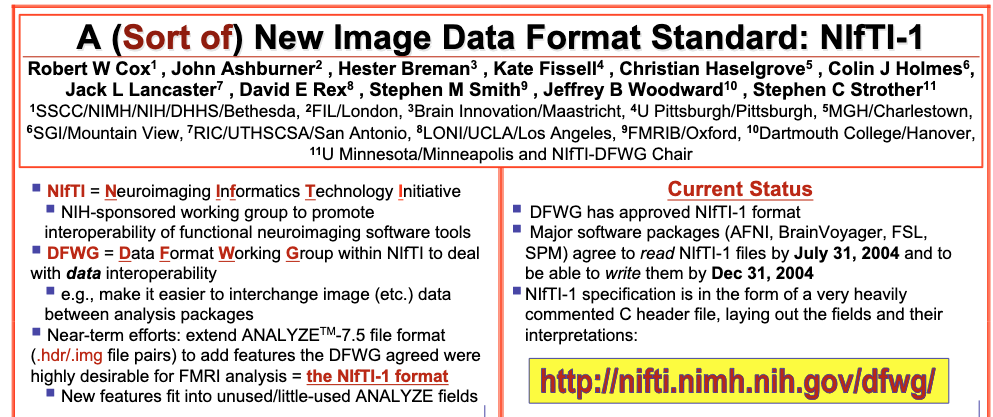

:::
::::
:::::

## NIfTI: Structure

::::: columns
:::: {.column width="50%" style="font-size: 65%;"}
- Modeled after Analyze 7.5 format
  - Backwards compatible
- Two formats supported:
  - Multiple file: .hdr = Header, .img = Image
  - Single file: .nii = Header & Image
- [Defined structure](https://brainder.org/2012/09/23/the-nifti-file-format/)
  - Eases use across modeling packages
::::

:::: {.column width="\"50%"}
::: {.r-stack}

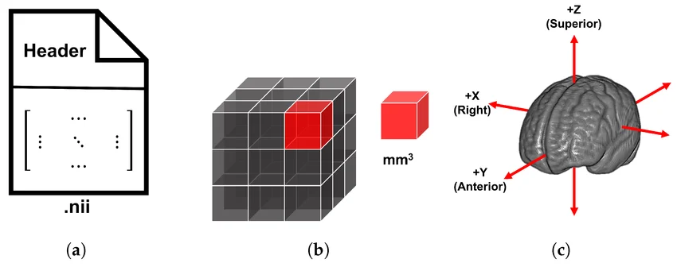

:::
::::
:::::

## NIfTI: Resolve issues

::::: columns
:::: {.column width="50%" style="font-size: 65%;"}
- Embed orientation
  - QForm: Map voxel to scanner frame of reference
  - SForm: Map voxel to common space (MNI)
  - Resolves ambiguous left
- Dimensionality
  - 3: Anatomical
  - 4: Functional
  - 6: Diffusion
  - 4-7: Statistical
::::

:::: {.column width="\"50%"}
::: {.r-stack}

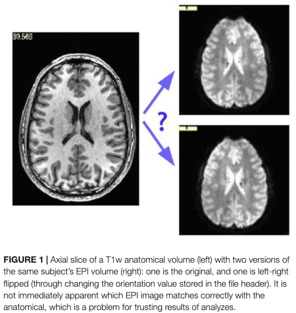{.fragment .fade-in-then-out}

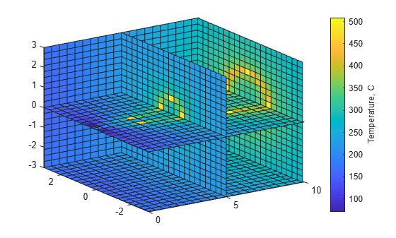{.fragment .fade-in-then-out}

:::
::::
:::::

## NIfTI: Orientation

::::: columns
:::: {.column width="50%" style="font-size: 65%;"}
- Describe in 3 dimensions:
  - 1: Left-Right (R)
  - 2: Anterior-Posterior (P)
  - 3: Superior-Inferior (S)
- Voxel reference:
  - 0 -> 256 (ref. corner)
  - -128 -> 128 (ref. AC-PC)
- Differing standards:
  - NIfTI: RAS (lowest: LPI)
  - DICOM: LPS
  - MNI: LPI
  - AFNI: RAI (highest: LPS)
::::

:::: {.column width="\"50%"}
::: {.r-stack}

{.fragment .fade-in-then-out}

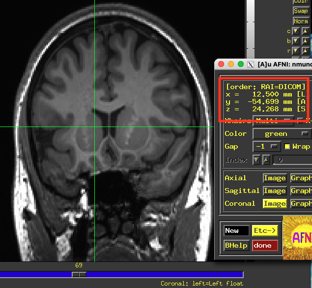{.fragment .fade-in-then-out}

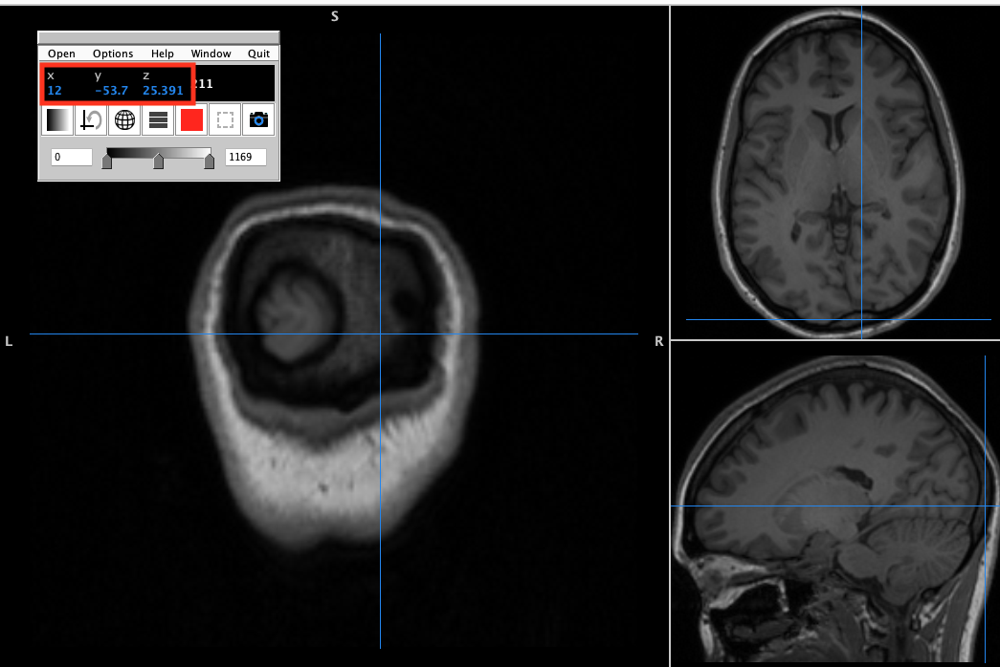{.fragment .fade-in-then-out}

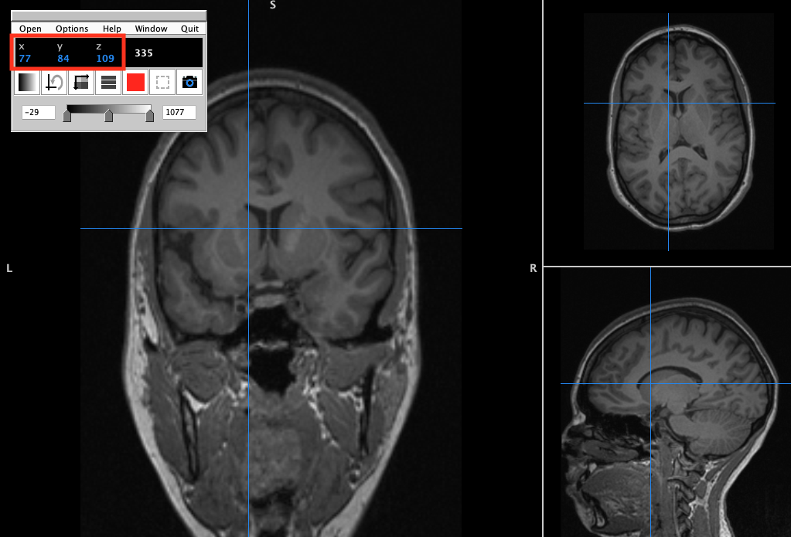{.fragment .fade-in-then-out}

:::
::::
:::::

## NIfTI: Conversion

::::: columns
:::: {.column width="50%" style="font-size: 65%;"}
- [dcm2niix](https://github.com/rordenlab/dcm2niix): most common
- [heudiconv](https://heudiconv.readthedocs.io/en/latest/): very common
  - Wrapper of dcm2niix
- Steps:
  1. Read through DICOM metadata
  2. Extract relevant data elements
  3. Organize slices by data types
  4. Combine slices into volumes
  5. Organize volumes into matrix
::::

:::: {.column width="\"50%"}
```{bash}
#| echo: true
#| eval: false
#!/bin/bash
dcm2niix \
  -z y \
  -f %p_%t_%s \
  -o /path/output \
  /path/to/dicom/folder
```
:::{style="font-size: 50%;"}
- -z: GZip NIfTI file
- -f: Output name uses protocol, acquisition, series
- -o: Output location
- last: Input DICOM directory
:::
::::
:::::

## NIfTI: Mining Header

::::: columns
:::: {.column width="50%" style="font-size: 65%;"}
- Same reasons as DICOM mining
  - NIfTI metadata has less information
- Useful tools:
  - AFNI's [3dinfo](https://afni.nimh.nih.gov/pub/dist/doc/program_help/3dinfo.html)
  - FSL's [fslhd](https://fsl.fmrib.ox.ac.uk/fsl/docs/utilities/fslutils.html#fslhd)
  - NiBabel's [img.header](https://nipy.org/nibabel/nibabel_images.html)
  - R's [RNifti::niftiHeader](https://cran.r-project.org/web/packages/RNifti/readme/README.html)
  - Matlab [niftiinfo](https://www.mathworks.com/help/images/ref/niftiinfo.html)
::::

:::: {.column width="\"50%"}
::: {.r-stack}

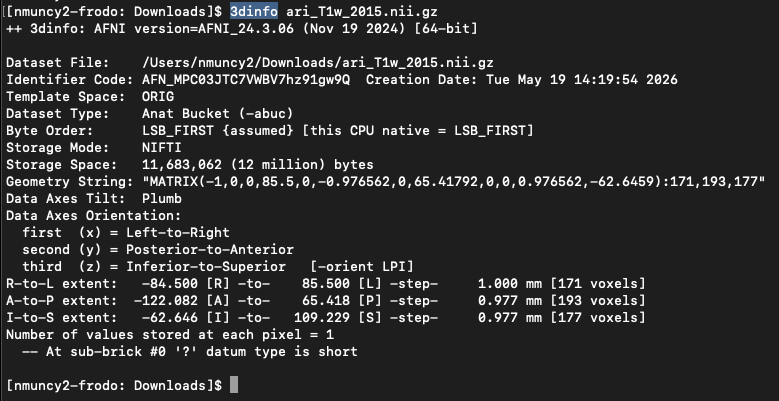{.fragment .fade-in-then-out}

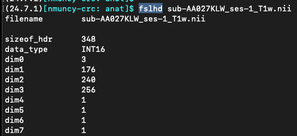{.fragment .fade-in-then-out}

:::
::::
:::::

## Sources

:::: {.columns}
::: {.column width="50%" style="font-size: 30%"}

Medical Image

- [Radiopaedia](https://radiopaedia.org/articles/mri-sequences-overview?lang=us)
- [Sprawls](https://www.sprawls.org/mripmt/MRI09/index.html)
- Atkinson, D. (2022). Geometry in medical imaging: DICOM and NIfTI formats.

Medical Image: Three P's

- [Pixel Depth](https://www.the-working-man.org/2014/12/bit-depth-color-precision-in-raster.html)
- [Photometric](https://www.renewedvision.com/blog/color-depth-and-channels-explained)
- [Pixel Data](https://neubias.github.io/training-resources/image_file_formats/index.html)

Medical Image: Metadata

- [Pixel Data](https://neubias.github.io/training-resources/image_file_formats/index.html)

Clinical Data: DICOM

- [DICOM](https://dicom.offis.de/en/general/dicom-introduction/)

DICOM: Structure

- [Header](https://www.leadtools.com/help/sdk/v20/dicom/api/overview-basic-dicom-file-structure.html)
- [Structure](https://www.oak-tree.tech/blog/dicom-primer)

:::
::: {.column width="\"50%" style="font-size: 30%"}

DICOM: Data Element

- [Data Element](https://dicom.nema.org/medical/dicom/current/output/chtml/part05/chapter_7.html)

Research Data: Tower of Babel

- [XKCD](https://xkcd.com/927)

NIfTI: Structure

- Althobaiti, N., Moria, K., Elrefaei, L., Alghamdi, J., & Tayeb, H. (2025). Construction of a Structurally Unbiased Brain Template with High Image Quality from MRI Scans of Saudi Adult Females. Bioengineering, 12(7), 722.

NIfTI: Resolve Issues

- Glen, D. R., Taylor, P. A., Buchsbaum, B. R., Cox, R. W., & Reynolds, R. C. (2020). Beware (surprisingly common) left-right flips in your MRI data: an efficient and robust method to check MRI dataset consistency using AFNI. Frontiers in neuroinformatics, 14, 18.

- [4D Data](https://www.mathworks.com/help/matlab/visualize/visualizing-four-dimensional-data.html)

NIfTI: Orientation

- Li, X., Morgan, P. S., Ashburner, J., Smith, J., & Rorden, C. (2016). The first step for neuroimaging data analysis: DICOM to NIfTI conversion. Journal of neuroscience methods, 264, 47-56.


<!-- Outline: Review larobina 2014
Data string, medical image
Pixel depth
Photometric interpretation
Metadata
Pixel data

Clinical
DICOM
File + network communication protocol
Header + Data, no separation
Comprehensive
Header - protocol, patient info, variable
Tags
  Format
  Order
Phoenix
LPS, 0 = iso

Research
Analyze
Header, Data
Simple
Formal structure
NIfTI
Resolve issues (ambiguous left)
Embed orietnation
Multidim - fMRI (4), DWI (6), statistics (4-7)
RAS, 0 = AC

View DICOM
Mine DICOM header
dcm2niix
View NIfTI
Mine NIfti header
-->

<!-- Practice - Install AFNI, FSL. Mine DICOM header
Practice - Install Mango, view DICOM stack
Practice - Mine info from fruit
-->
:::
::::