## Studying the brain is hard
<!-- https://academic.oup.com/brain/article-abstract/137/2/621/280970?redirectedFrom=fulltext&login=false -->
<!-- https://www.researchgate.net/publication/281682917_Dull_Brains_Mountaineers_and_Mosso_Hypoxic_Words_from_on_High -->
<!-- https://pmc.ncbi.nlm.nih.gov/articles/PMC494289/ -->
<!-- https://en.wikipedia.org/wiki/History_of_neuroimaging -->
<!-- https://en.wikipedia.org/wiki/Pneumoencephalography -->
::::: columns
:::: {.column width="50%" style="font-size: 65%;"}
- Soft tissue surrounded by bone
- Opening the skull is discouraged
- [Angelo Mosso](../../articles/mosso_weigh.pdf) (and [this](../../articles/mosso_dull_brains.pdf) article)
- 122 years of [Neuroimaging History](../../articles/leeds_imaging_1904_1999.pdf)
::::

:::: {.column width="\"50%"}
::: {.r-stack}

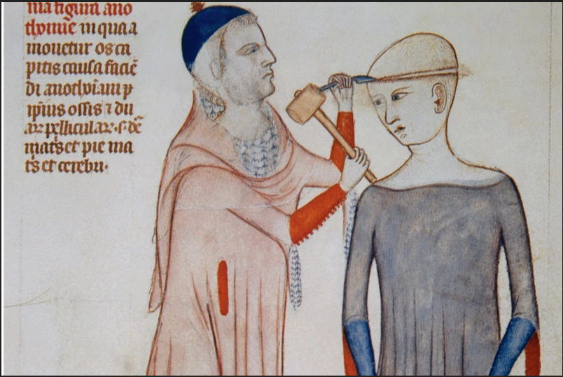{.fragment .fade-in-then-out}

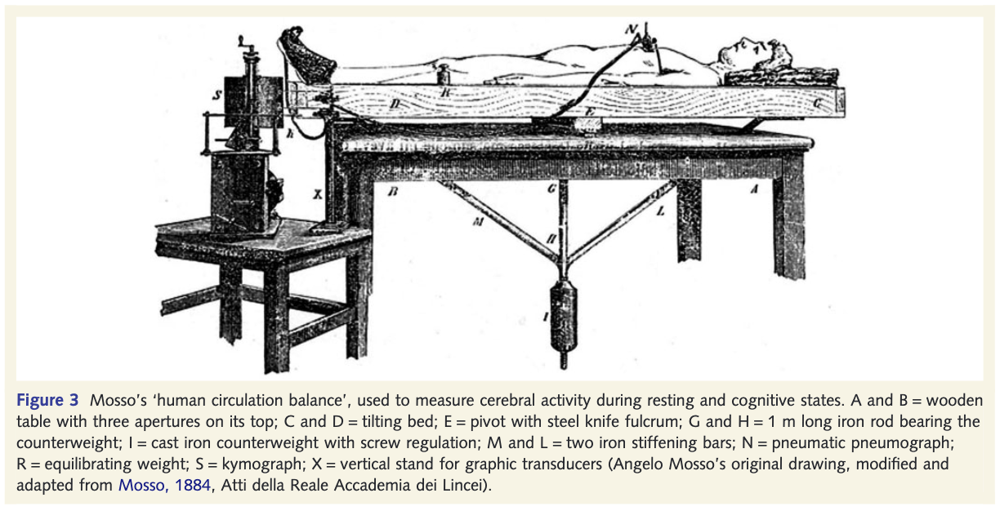{.fragment}

:::
::::
:::::

::: {.notes}
- 1882 Angelo Mosso invented 'human circulation balance'
- Idea: Balance body at rest, then test
- Low replication, idea persisted
:::

## First Efforts
::::: columns
:::: {.column width="50%" style="font-size: 65%;"}
- X-ray
- [Pneumoencephalography](../../articles/white_pneumo_sequelae.pdf)
- Limitations:
    - Resolution
    - Health risks
::::

:::: {.column width="\"50%"}
::: {.r-stack}

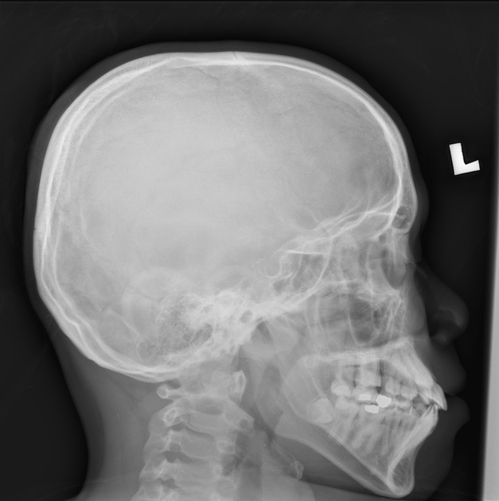{.fragment .fade-in-then-out}

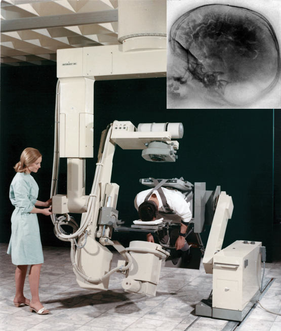{.fragment .fade-in-then-out}

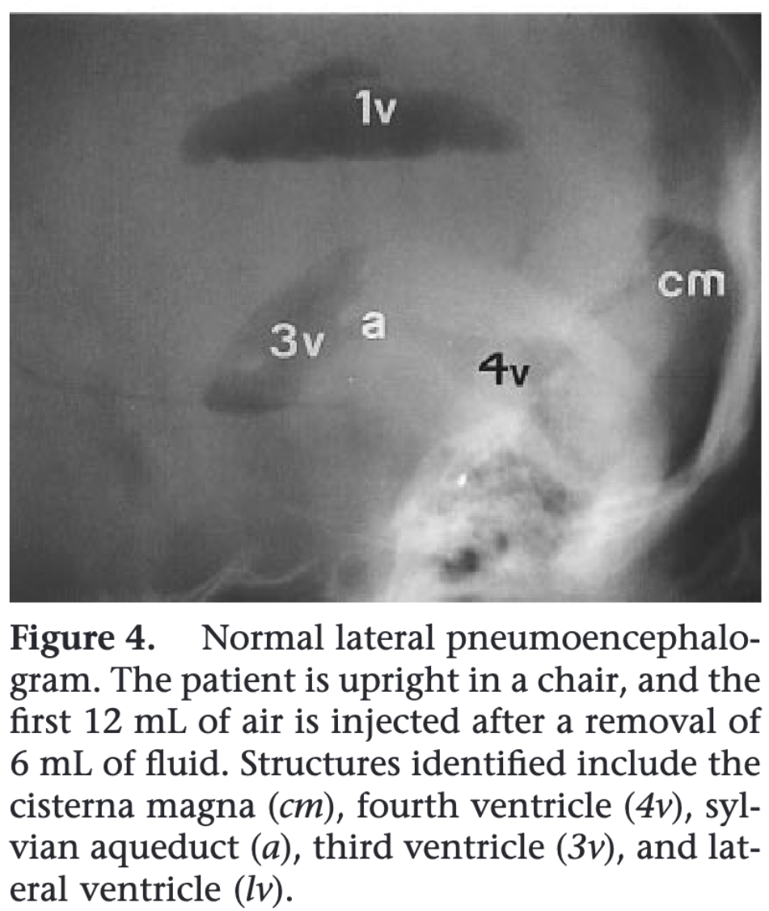{.fragment}
:::
::::
:::::

::: {.notes}
- X-ray useful for visualizing bone, not helpful with tissue
- Pneumo:
    - invert person
    - extract 35-50 ML CSF from lumbar
    - reorient person - air bubble rises
    - adjust orientation to visualize different regions
:::

## What is MRI?
::::: columns
:::: {.column width="50%" style="font-size: 65%;"}
- Nuclear Magnetic Resonance Imaging:
    - Certain nuclei (H+) align with magnetic field
    - Respond to secondary field
    - Emit electromagnetic signal
- Number of discoveries:
    - [Rabi](../../articles/rabi_1938.pdf) - NMR (molecular beams)
    - [Bloch](../../articles/bloch_1946.pdf) and Purcell - NMR (liquids, solids)
    - [Lauterbur](../../articles/lauterbur_1973_mri.pdf) and Mansfield - MRI
- Intersection: Physics, Engineering, CompSci, Neuroscience, Psychology
::::

:::: {.column width="\"50%"}
::: {.r-stack}

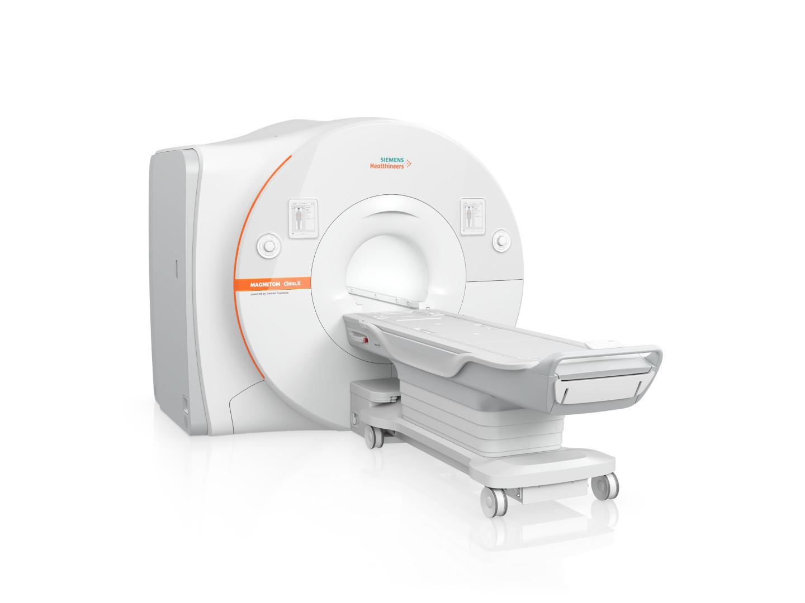

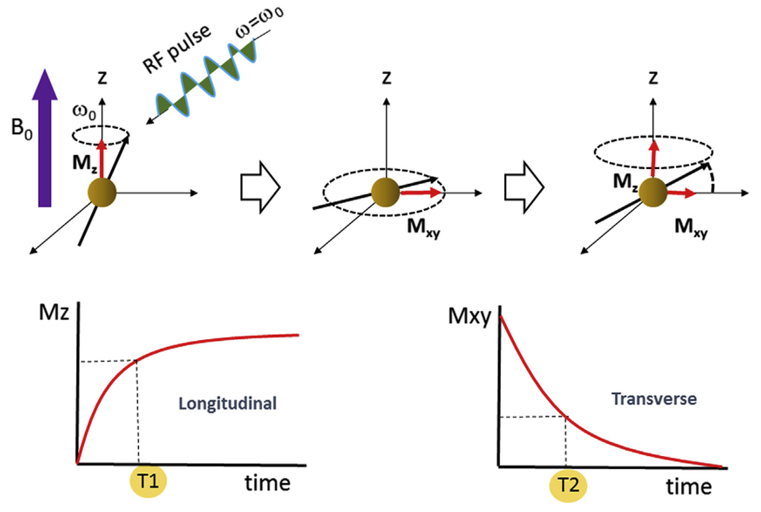{.fragment}
:::
::::
:::::

::: {.notes}
- Isidor Rabi (1938) first described NMR; Nobel Prize 1944
- Felix Bloch, Edward Purcell extended to liquids, solids; Nobel Prize 1952
- Lauterbur, Mansfield; biologically useful MRI, EPI; Nobel Prize 2003
:::

## Magnetic Field
::::: columns
:::: {.column width="50%" style="font-size: 65%;"}
- Principles of [electromagnetism](https://www.youtube.com/watch?v=tXI7Wd1ElF8)
- Superconductivity
    - Copper
    - Liquid He+
- 3 Tesla ([2000+](https://www.youtube.com/watch?v=6BBx8BwLhqg) lbs attraction)
    - Smooth, consistent field
    - Always ON!
::::

:::: {.column width="\"50%"}
::: {.r-stack}

{.fragment .fade-in-then-out}

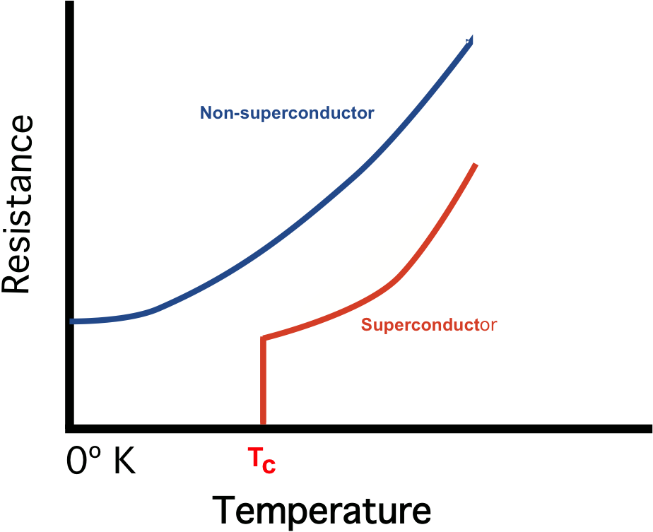{.fragment .fade-in-then-out}

{.fragment .fade-in-then-out}

{.fragment}
:::
::::
:::::

::: {.notes}

:::

## Safety Considerations
::::: columns
:::: {.column width="50%" style="font-size: 65%;"}
- Rarely are rooms [fatal](https://smithchason.edu/mri-safety-lessons-1980-2001-2025/)
- Strict [Zoning](https://mriquestions.com/acr-safety-zones.html) helps
- Diligence: avoid complacency and [survivorship bias](https://en.wikipedia.org/wiki/Survivorship_bias)
- Magnetic field has significant [acceleration](https://www.youtube.com/watch?v=IF6CMrjGNN4)
- Injuries are more [common](../../articles/inaguma_2023_injuries.pdf) than they should be
::::

:::: {.column width="\"50%"}
::: {.r-stack}

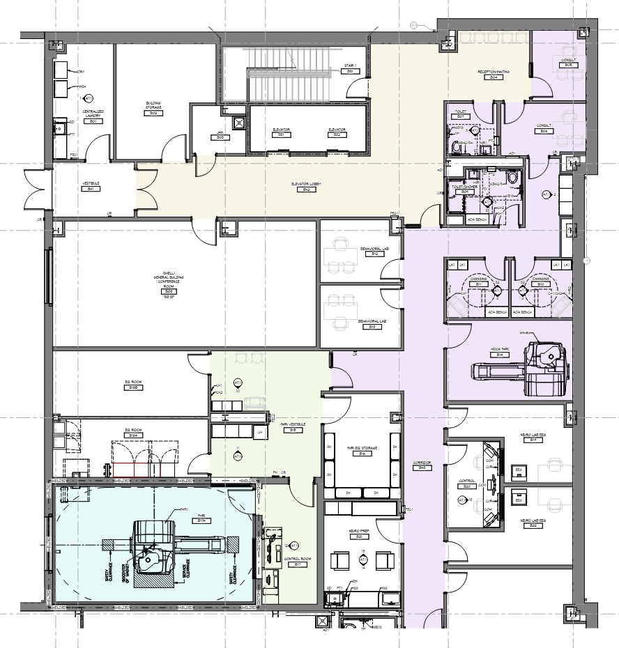{.fragment .fade-in-then-out}
:::
::::
:::::

## Proton Precession
::::: columns
:::: {.column width="50%" style="font-size: 65%;"}
- Spin: [fundamental property](https://www.quantumdiaries.org/2016/02/01/spun-out-of-proportion-the-proton-spin-crisis/)
    - [Not classical rotation](https://photonics101.com/magnetostatics-currents-and-fields/spin-is-not-a-rotation.html)
    - [Stressful](https://en.wikipedia.org/wiki/Proton_spin_crisis)
- Magnetic Alignment
- Larmor Frequency
::::

:::: {.column width="\"50%"}
::: {.r-stack}

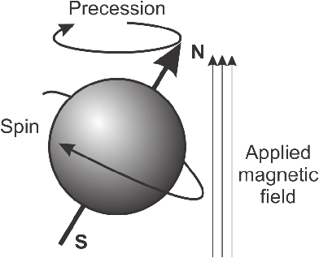

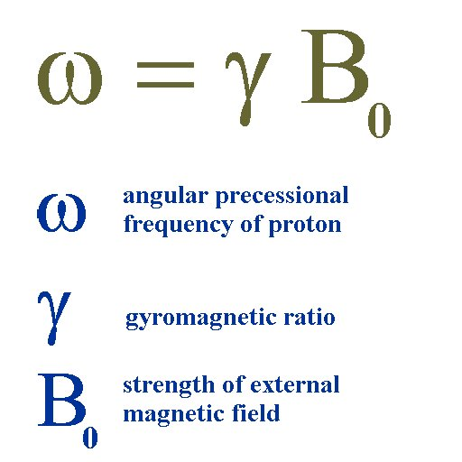{.fragment .fade-in-then-out}
:::
::::
:::::

## Field Gradients
:::: columns
::: {.column width="50%" style="font-size: 65%;"}
- Micro adjustments to magentic field
    - Control precession!
- 3 dimensions
    - Provide resolution
- Larmor frequency - ability to target specific regions
:::

::: {.column width="\"50%"}
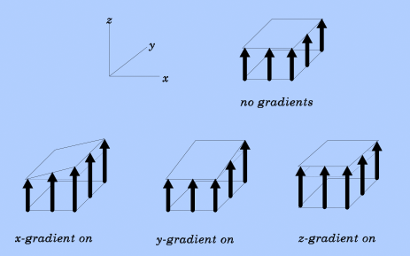
<!--  -->
:::
::::

<!-- ## Excitation
Pulse
Energy states

## Recovery
Longitudinal decay
Transverse recovery

## Signal -->

## T1 Contrast
::::: columns
:::: {.column width="50%" style="font-size: 65%;"}
- Head composed of multiple materials
    - Skull
    - CSF
    - Brain
- Differing magnetic properties
- Identify useful tissue contrast
::::

:::: {.column width="\"50%"}
::: {.r-stack}

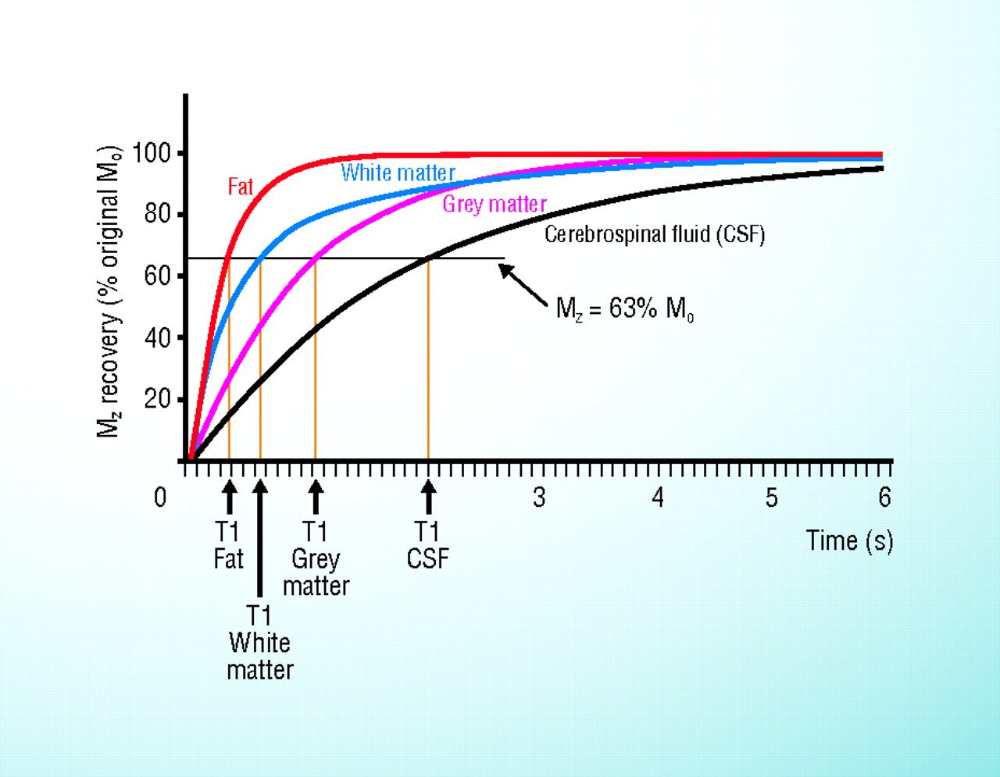

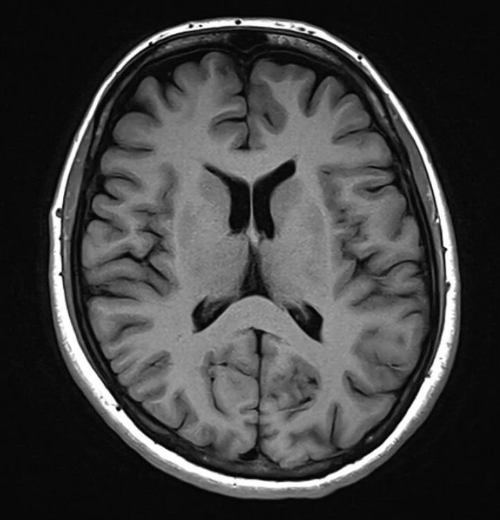{.fragment .fade-in-then-out}
:::
::::
:::::

## T2* Contrast
::::: columns
:::: {.column width="50%" style="font-size: 65%;"}
- Hemoglobin
    - Oxygenated (Hb): Diamagnetic
    - Deoxgenated (dHb): Paramagentic
- Contrast: Hb/dHb ratio
- All brain tissue always active
    - Increased neural metabolism: change in Hb/dHb
- Functional MRI
    - Blood Oxygen Level Dependent (BOLD) signal
::::

:::: {.column width="\"50%"}
::: {.r-stack}

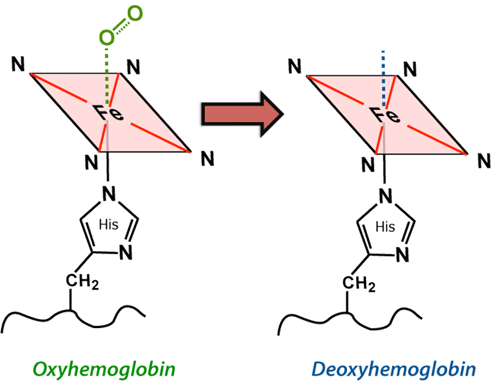{.fragment .fade-in-then-out}

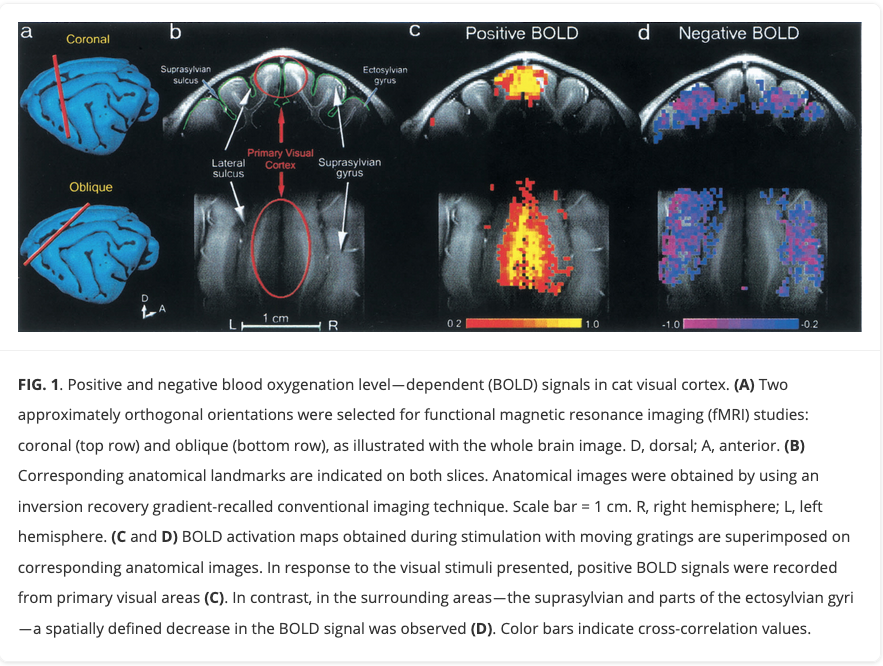{.fragment .fade-in-then-out}
:::
::::
:::::

## Design
:::: columns
::: {.column width="50%" style="font-size: 65%;"}
- Contrast: neural or cognitive operations
    - Ocular dominance in [humans](../../articles/cheng_2001_human.pdf) and [cats](../../articles/zhang_2010_cat.pdf)
    - Poor vs Successful memory
- Think deeply about contrast
    - Memory + color, shape, label, use, experience
:::

::: {.column width="\"50%"}
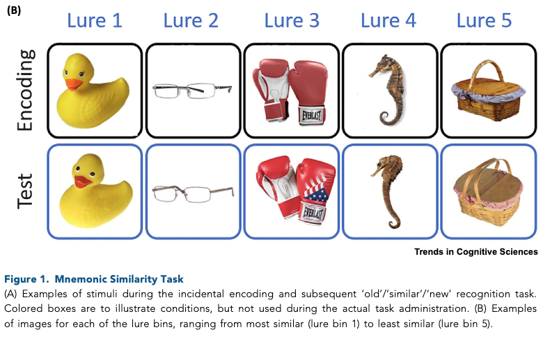
:::
::::

::: {.notes}
Group differences - Miami and alligators
:::

## Limitations
::::: columns
:::: {.column width="50%" style="font-size: 65%;"}
- Multiple levels removed from neural processes
- Speed of cognition (ms) vs haemodynamic response (s)
- Cost
    - Funding difficulties
    - Power issues
    - Hardware, compute infrastructure
- Compatibility
- Laboratory effect
::::

:::: {.column width="\"50%"}
::: {.r-stack}

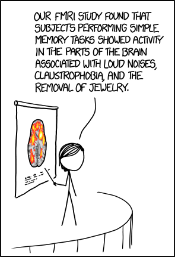{.fragment .fade-in-then-out}

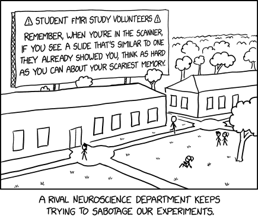{.fragment .fade-in-then-out}
:::
::::
:::::

## Topologic Results

<iframe src="topo_strength.html" style="width: 100%; height: 100%;" scrolling="no" allowfullscreen></iframe>

## Diffusion Results

<iframe src="dwi_tracts.html" style="width: 100%; height: 100%;" scrolling="no" allowfullscreen></iframe>

## Sources
- [Trepanation](https://www.historyextra.com/period/prehistoric/what-trepanning-ancient-surgical-procedure-skulls-when-first)
- Leeds
- Mosso
- Mosso
- White
- [Pneumoencephalography](https://www.americanscientist.org/article/the-early-years-of-brain-imaging)
- Rabi
- Bloch
- Lauterbur
- [Fatalities](https://smithchason.edu/mri-safety-lessons-1980-2001-2025/)
- Inaguma
- Cat Paper (https://journals.sagepub.com/doi/10.1097/00004647-200208000-00002)
- Human Paper (https://www.cell.com/action/showPdf?pii=S1364-6613%2819%2930204-9)
- Stark paper
- XKCD 1: https://imgs.xkcd.com/comics/fmri.png
- XKCD 2: https://imgs.xkcd.com/comics/fmri_billboard.png