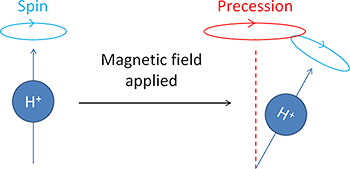

## Studying the brain is hard
<!-- https://academic.oup.com/brain/article-abstract/137/2/621/280970?redirectedFrom=fulltext&login=false -->
<!-- https://www.researchgate.net/publication/281682917_Dull_Brains_Mountaineers_and_Mosso_Hypoxic_Words_from_on_High -->
<!-- https://pmc.ncbi.nlm.nih.gov/articles/PMC494289/ -->
<!-- https://en.wikipedia.org/wiki/History_of_neuroimaging -->
<!-- https://en.wikipedia.org/wiki/Pneumoencephalography -->
:::: columns
::: {.column width="50%" style="font-size: 65%;"}
- Imaging the brain is hard
    - Soft tissue surrounded by bone
- Opening the skull is discouraged
- [Angelo Mosso](../../articles/mosso_weigh.pdf) (and [this](../../articles/mosso_dull_brains.pdf) article)
- See [here](../../articles/leeds_imaging_1904_1999.pdf) for history
:::

::: {.column width="\"50%"}

:::
::::

::: {.notes}
- 1882 Angelo Mosso invented 'human circulation balance'
- Idea: Balance body at rest, then provide
:::

## Previous methods
:::: columns
::: {.column width="50%" style="font-size: 65%;"}
- X-ray
- [Pneumoencephalography](../../articles/white_pneumo_sequelae.pdf)
- Limitations:
    - Resolution
    - Health risks
:::

::: {.column width="\"50%"}

:::
::::

::: {.notes}
- X-ray useful for visualizing bone, not helpful with tissue
- Pneumo:
    - invert person
    - extract 35-50 ML CSF from lumbar
    - reorient person - air bubble rises
    - adjust orientation to visualize different regions
:::

## What is MRI
<!-- Definition (Nuclear, Magnetic)
History
Engineering and Quantum Mechanics
Fun, hard
Computer science, physics, neuroscience, psychology -->
:::: columns
::: {.column width="50%" style="font-size: 65%;"}
- Nuclear Magnetic Resonance Imaging
    - Certain nuclei (H+) align with magnetic field
    - Respond to secondary field
    - Emit electromagnetic signal
- Number of scientific discoveries:
    - [Rabi](../../articles/rabi_1938.pdf) - NMR (molecular beams)
    - [Bloch](../../articles/bloch_1946.pdf) and Purcell - NMR (liquids, solids)
    - [Lauterbur](../../articles/lauterbur_1973_mri.pdf) and Mansfield - MRI
- Intersection of engineering and quantum mechanics
- Fun, hard
    - Physics
    - Computer Science
    - Neuroscience
    - Psychology
:::

::: {.column width="\"50%"}

:::
::::

::: {.notes}
- Isidor Rabi (1938) first described NMR; Nobel Prize 1944
- Felix Bloch, Edward Purcell extended to liquids, solids; Nobel Prize 1952
- Lauterbur, Mansfield; biologically useful MRI, EPI; Nobel Prize 2003
:::

## Magnetic Field
<!-- Copper
Super cold properties
Super conductivity
Liquid Helium
Strength -->

:::: columns
::: {.column width="50%" style="font-size: 65%;"}
- Electromagnetic
- Superconductivity
    - Copper
    - Liquid He+
- 3 Tesla ([2000+](https://www.youtube.com/watch?v=6BBx8BwLhqg) lbs attraction)
    - Smooth, consistent field
    - Always ON!
:::

::: {.column width="\"50%"}

:::
::::

::: {.notes}
- MRI based on simple
:::

## Safety
<!-- Fatalities -->
:::: columns
::: {.column width="50%" style="font-size: 65%;"}
- Room is [fatal](https://smithchason.edu/mri-safety-lessons-1980-2001-2025/)
- [Acceleration](https://www.youtube.com/watch?v=IF6CMrjGNN4)
- Injuries
- Fatalities
:::

::: {.column width="\"50%"}

:::
::::

## Precession
<!-- Protons properties
Precession
Larmor Frequency -->

:::: columns
::: {.column width="50%" style="font-size: 65%;"}
- Proton Spin
- Proton Alignment
- Precession
- Larmor Frequency
:::

::: {.column width="\"50%"}

:::
::::

## Gradient
<!-- Finetune precession -->

:::: columns
::: {.column width="50%" style="font-size: 65%;"}
- Control precession
- 3 dimensions
- Provide resolution
:::

::: {.column width="\"50%"}

:::
::::

<!-- ## Excitation
Pulse
Energy states

## Recovery
Longitudinal decay
Transverse recovery

## Signal -->

## Contrast
:::: columns
::: {.column width="50%" style="font-size: 65%;"}
- Head composed of multiple materials
    - Skull
    - CSF
    - Brain
- Differing magnetic properties
- Identify useful tissue contrast
:::

::: {.column width="\"50%"}

:::
::::

## BOLD
:::: columns
::: {.column width="50%" style="font-size: 65%;"}
- Hemoglobin
    - Oxygenated (Hb): Diamagnetic
    - Deoxgenated (dHb): Paramagentic
- Contrast: Hb/dHb ratio
- All brain tissue always active
    - Increased neural metabolism: change in Hb/dHb
- Functional MRI
    - Blood Oxygen Level Dependent (BOLD) signal
:::

::: {.column width="\"50%"}

:::
::::

## Design
<!-- Subtraction
Stimulus delivery
Behavioral response -->

:::: columns
::: {.column width="50%" style="font-size: 65%;"}
- Contrast: neural or cognitive operations
    - Ocular dominance in [humans](../../articles/cheng_2001_human.pdf) and [cats](../../articles/zhang_2010_cat.pdf)
    - Poor vs Successful memory
- Think deeply about contrast
    - Memory + color, shape, label, use, experience
:::

::: {.column width="\"50%"}

:::
::::

::: {.notes}
Group differences - Miami and alligators
:::

## Limitations
<!-- Cost
Compatibility -->

::: columns
::: {.column width="50%" style="font-size: 65%;"}
- Multiple levels removed from neural processes
- Speed of cognition (ms) vs haemodynamic response (s)
- Cost
    - Funding difficulties
    - Power issues
    - Hardware, compute infrastructure
- Compatibility
- Laboratory effect
:::

::: {.column width="\"50%"}

:::
::::

## Topologic Results

<iframe src="topo_strength.html" style="width: 100%; height: 100%;" scrolling="no" allowfullscreen></iframe>

## Diffusion Results

<iframe src="dwi_tracts.html" style="width: 100%; height: 100%;" scrolling="no" allowfullscreen></iframe>