## Data Types

::::: columns
:::: {.column width="50%" style="font-size: 65%;"}
MRI ability to gather different types of data

- Term: MRI sequence
- Callibrated for distinct tissue properties

Examples:

- T1w: gray vs white matter
- T2w: fat vs water
- Flair: white matter lesions
- DWI: diffusion of water molecules
- SWI: compounds that distort magnetic field

<!-- Others:

- PD: proton density
- Perfusion: blood flow
- fMRI: blood oxygenation -->
::::

:::: {.column width="\"50%"}
::: {.r-stack}
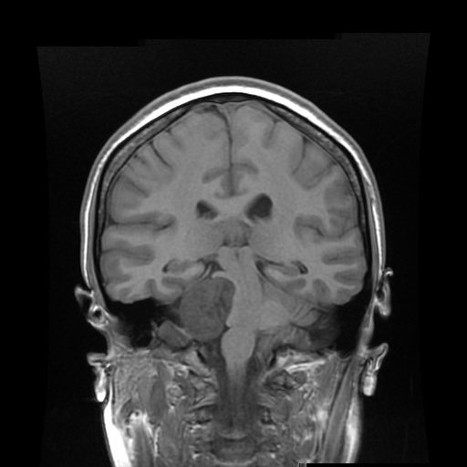{.fragment .fade-in-then-out}

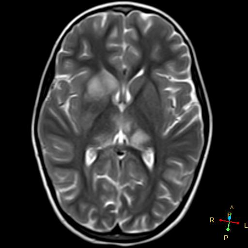{.fragment .fade-in-then-out}

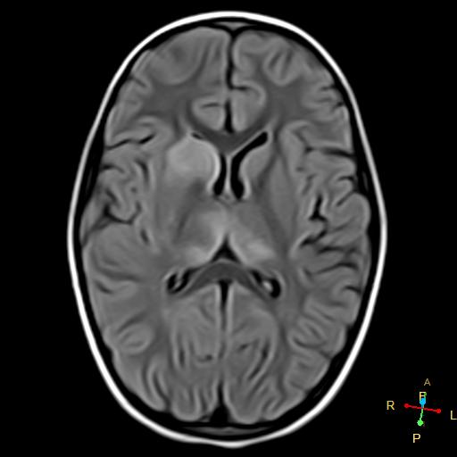{.fragment .fade-in-then-out}

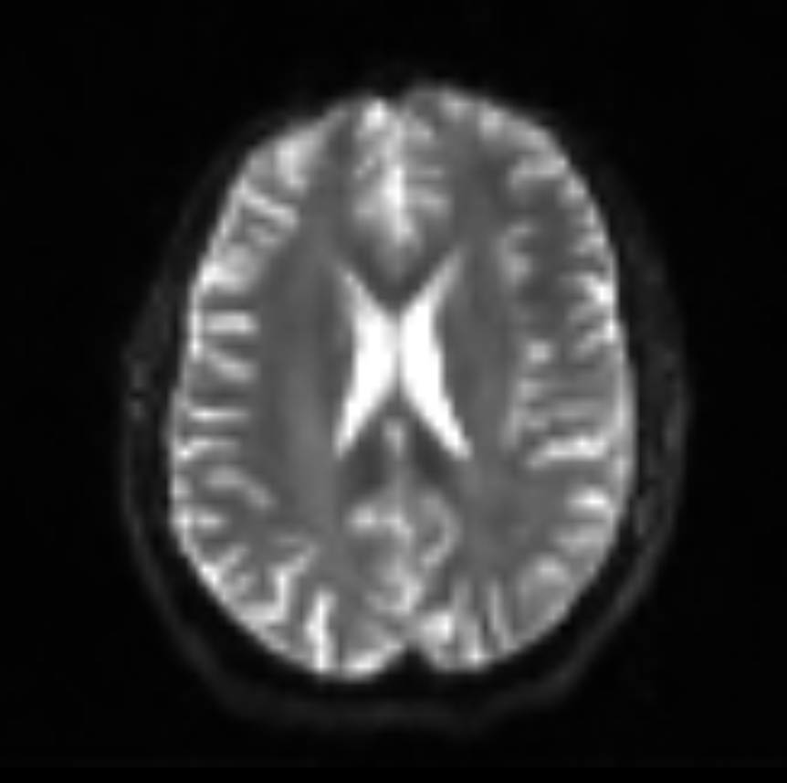{.fragment .fade-in-then-out}

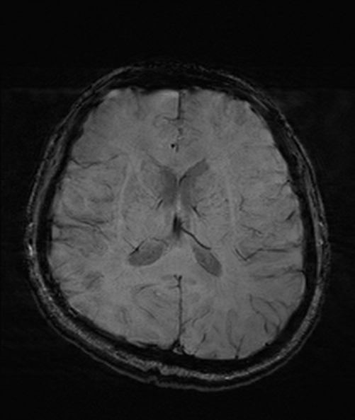{.fragment .fade-in-then-out}
:::
::::

:::{.notes}
<!-- Proton align to Bo - Mz
Known precession
Resonant RF Pulse
High energy state
Phase alignment
Oscillating signal in B1, Mxy
T2 decay (dephase), decrease Mxy
Tissue type in T2 decay (water slow, fat middle, muscle fast)
180 Pulse - invert dephase -> rephase
(Frequency encoding gradient, phase encoding gradient)
Signal from fat (high), water (low) -->
:::

:::::

## Essentials Principles

::::: columns
:::: {.column width="50%" style="font-size: 65%;"}
- Typically capitalize on H^+^ properties
- Fundamental to MRI sequences, control:
  - Pulse
  - Orientation
  - Phase
  - Frequency
  - Read time
::::

:::: {.column width="\"50%"}

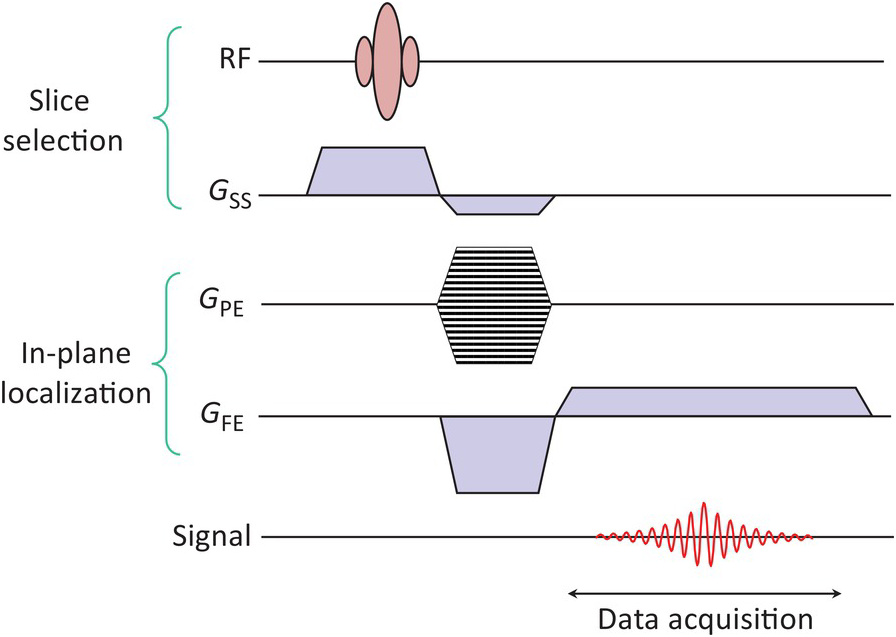

::::
:::::

## Precession

::::: columns
:::: {.column width="50%" style="font-size: 65%;"}
- Protons - slightly positive (H^+^)
- Inherent spin
  - Precession
  - Magnetic moment
- Align with magnetic field
  - Low, high energy states
  - Net Magnetization
  - Frequency (Larmor)
- Critical:
  - Known proton properties
  - Control protons with field gradients

::::

:::: {.column width="\"50%"}
::: {.r-stack}

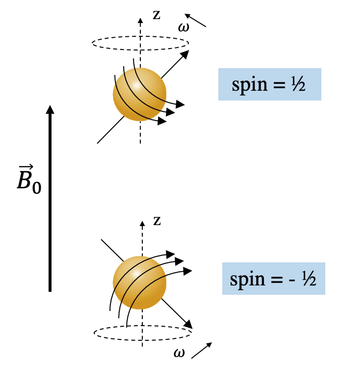{.fragment .fade-in-then-out}

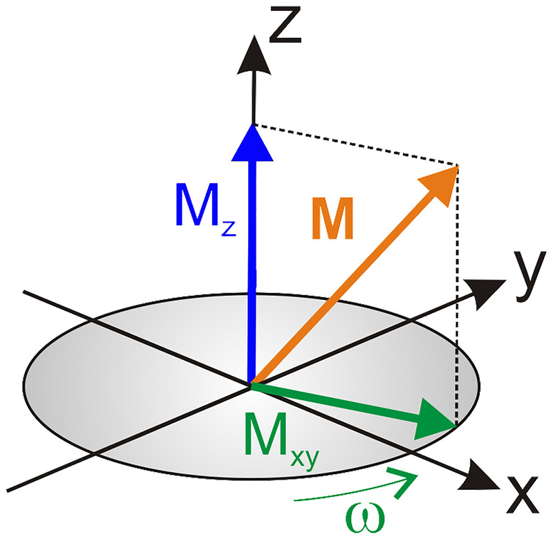{.fragment .fade-in-then-out}

:::
::::
:::::

## Excitation

::::: columns
:::: {.column width="50%" style="font-size: 65%;"}
- Engage with protons
  - Provide resonant electromagnetic radiation
  - Same frequency as known precession (Larmor)
  - Radiofrequency Pulse (42.58 MHz/T)
- Protons flip from low to high energy state
- Energy lost as thermal over time
  - T1, longitudinal recovery
  - Differing rates
- Not sufficient for imaging
  - Collect data only in transverse plain
::::

:::: {.column width="\"50%"}
::: {.r-stack}

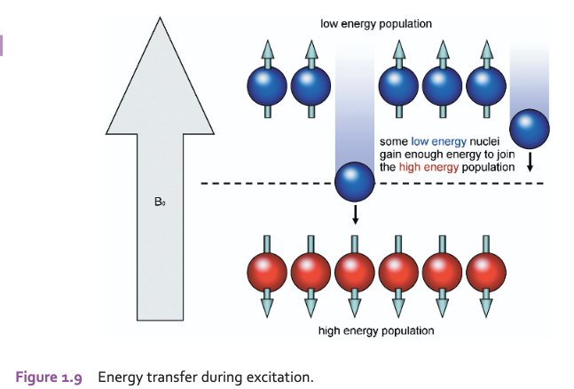{.fragment .fade-in-then-out}

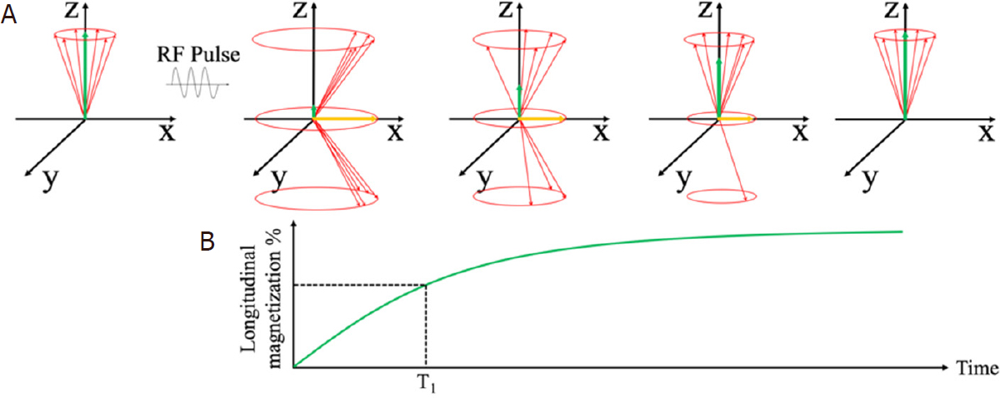{.fragment .fade-in-then-out}

{.fragment .fade-in-then-out}

:::
::::
:::::

## Phase

::: {.r-stack}

{.fragment .fade-in-then-out fig-align="center"}

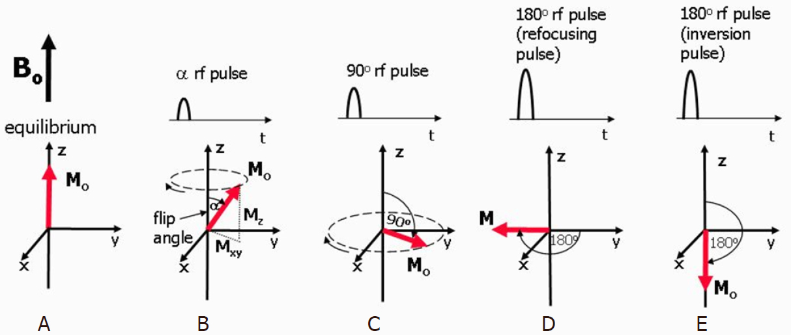{.fragment .fade-in-then-out fig-align="center"}

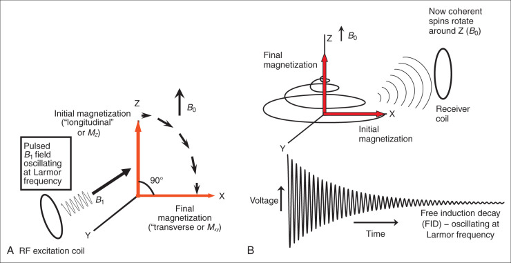{.fragment .fade-in-then-out fig-align="center"}

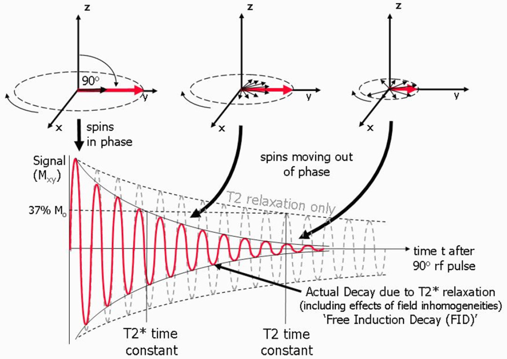{.fragment .fade-in-then-out width=80% fig-align="center"}

:::

<!-- Signal in transverse plane
Pulse - Phase Alignment
Bo and Mz -> Mxy
Rotating Mxy - induce current - MRI signal -->

## Dephase

::::: columns
:::: {.column width="50%" style="font-size: 65%;"}
- Protons have variable decay rates
  - Spin-spin interactions
  - Field strength
  - Tissue type
- Dephase - decrease Mxy signal
  - Transverse Decay
- Tissue types have different decay rates
  - Useful contrast!
- Different time scales:
  - T1, longitudinal recovery: seconds
  - T2, transverse decay: milliseconds

::::

:::: {.column width="\"50%"}
::: {.r-stack}

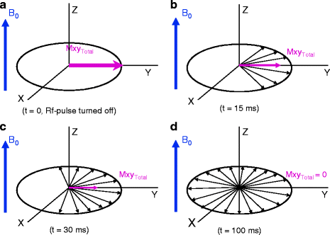{.fragment .fade-in-then-out}

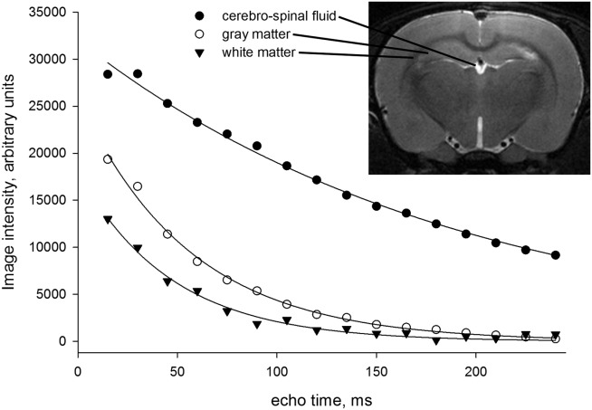{.fragment .fade-in-then-out}

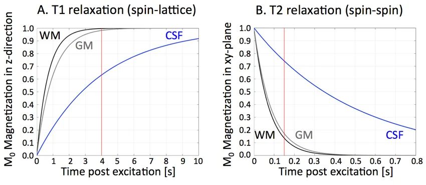{.fragment .fade-in-then-out}

:::
::::
:::::

## Inversion Pulse

::::: columns
:::: {.column width="50%" style="font-size: 65%;"}
- Tissue decay rates useful
- 180^o^ Pulse
  - Invert dephasing
  - Resultant rephasing!
- Signal strength increases with rephasing
  - Read signal at peak = TE
::::

:::: {.column width="\"50%"}
::: {.r-stack}

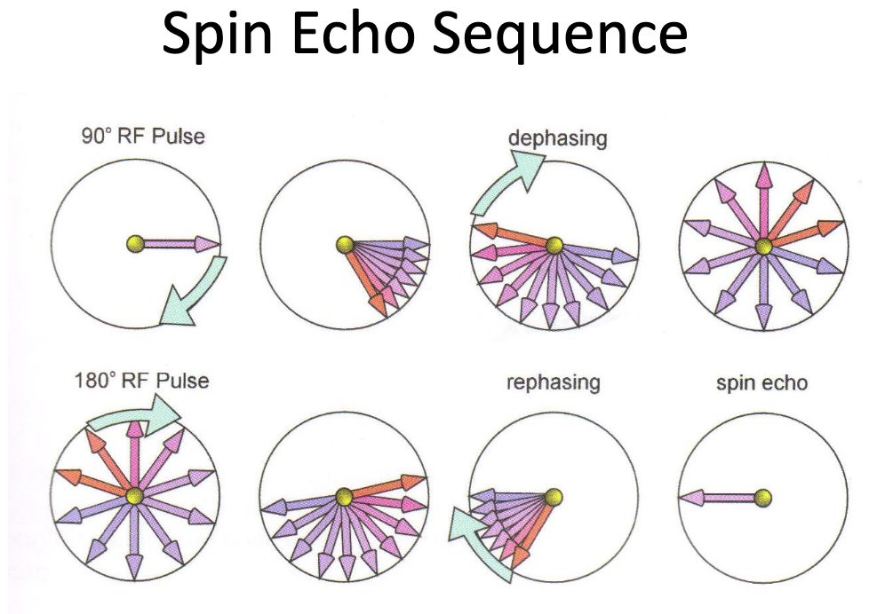{.fragment .fade-in-then-out}

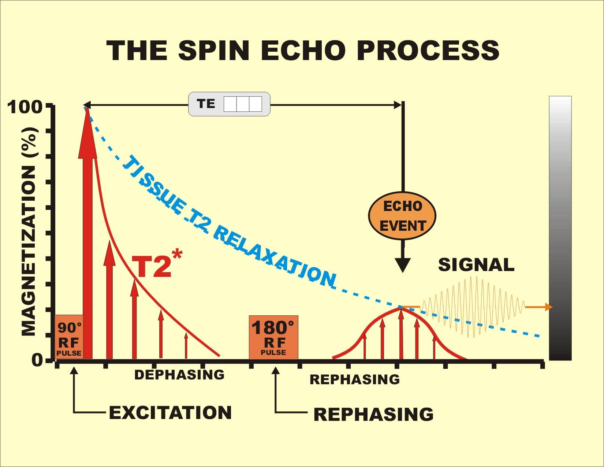{.fragment .fade-in-then-out}

:::
::::
:::::

## Recap

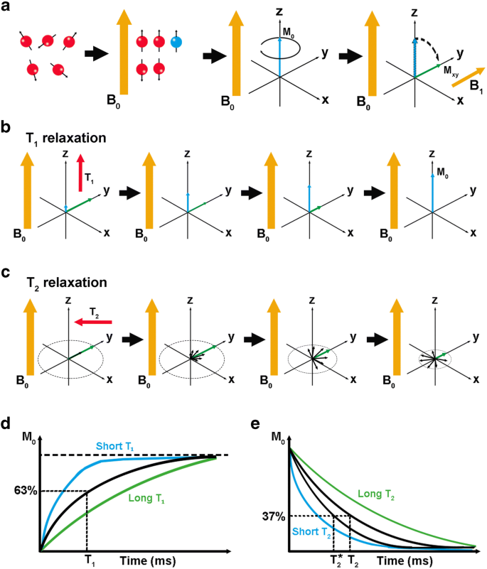{fig-align="center"}

## T1 vs T2 contrast

::::: columns
:::: {.column width="50%" style="font-size: 65%;"}
- T2: Capitalize on T2 decay
- T1?
  - Wait for T1 recovery
  - Inversion Pulse (repetition time)
  - Short TE
::::

:::: {.column width="\"50%"}
::: {.r-stack}

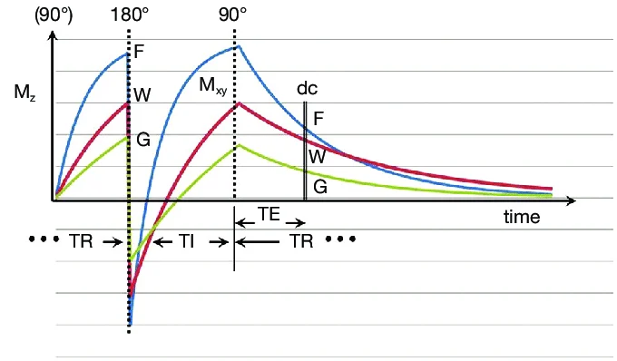

:::

:::{.notes}
The basic IR pulse sequence with M z then M xy plotted against time. After the initial 90° pulse from the preceding cycle of the pulse sequence the longitudinal magnetization M z is zero. It recovers with time constant T 1 and is inverted by the 180° pulse. M z then recovers during TI. When the second 90° pulse shown is applied M z becomes M xy . This decays with time constant T 2 during TE and is detected during the data collection (dc). Plots for fat (F), white matter (W) and gray matter (G) are shown. The signal shown on the image is proportional to the magnitude of M xy for F, W and G at the time of the dc. Each cycle of the sequence is described as beginning with a 180° pulse which is then followed after TI by a 90° pulse.
:::

::::
:::::

## Sources
:::: {.columns}
::: {.column width="50%" style="font-size: 25%"}
Data Types

- [Radiopaedia](https://radiopaedia.org/articles/mri-sequences-overview?lang=us)

Essential Principles

- McRobbie, D. W., Moore, E. A., Graves, M. J., & Prince, M. R. (2017). MRI from Picture to Proton. Cambridge university press.

Precession

- [Research Gate](https://www.researchgate.net/figure/Precession-of-protons-in-a-magnetic-field-B-0-one-with-spin-up-and-the-other-with_fig11_341098754)
<!-- - [Precession](https://mriquestions.com/why-precession.html) -->
- Radue, E. W., Weigel, M., Wiest, R., & Urbach, H. (2016). Introduction to magnetic resonance imaging for neurologists. Continuum: Lifelong Learning in Neurology, 22(5, Neuroimaging), 1379-1398.

Excitation

- [T1 excitation](https://catalogimages.wiley.com/images/db/pdf/9781444337433.excerpt.pdf)

- [T1 recovery](https://mri-2010.blogspot.com/2010/10/october-lecture-notes-1-image-density.html)

Phase

- Su, D., Wu, K., Saha, R., Liu, J., & Wang, J. P. (2020). Magnetic nanotechnologies for early cancer diagnostics with liquid biopsies: a review. Journal of Cancer Metastasis and Treatment, 6, N-A.

- [MR Basics](https://radiologykey.com/basic-principles-of-cardiovascular-magnetic-resonance/)

Dephase

- [Dephase](https://link.springer.com/chapter/10.1007/978-1-4614-1096-6_3)

- Liachenko, S., & Ramu, J. (2017). Quantification and reproducibility assessment of the regional brain T2 relaxation in naive rats at 7T. Journal of Magnetic Resonance Imaging, 45(3), 700-709.

- [Dissertation](https://www.researchgate.net/publication/294764549_Dissertation_Developing_Neuroimaging_Methods_to_Disentangle_Mild_Traumatic_Brain_Injury)

:::
::: {.column width="\"50%" style="font-size: 25%"}

Inversion Pulse

- [Spin Echo](https://www.sprawls.org/mripmt/MRI06/index.html)

- [Rephase](https://www.radcommons.org/residents/files/physics/20170209-MRI5-Pulse-sequences-1.pdf)

Recap

- Mastrogiacomo, S., Dou, W., Jansen, J. A., & Walboomers, X. F. (2019). Magnetic resonance imaging of hard tissues and hard tissue engineered bio-substitutes. Molecular imaging and biology, 21(6), 1003-1019.

T1 vs T2 Contrast

- Ma, Y. J., Fan, S., Shao, H., Du, J., Szeverenyi, N. M., Young, I. R., & Bydder, G. M. (2020). Use of multiplied, added, subtracted and/or fitted inversion recovery (MASTIR) pulse sequences. Quantitative Imaging in Medicine and Surgery, 10(6), 1334.

:::
::::